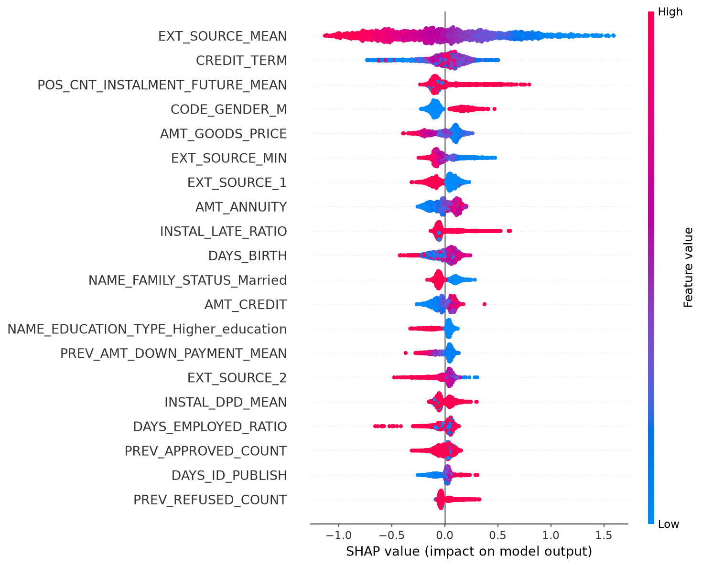

# 🏦 Credit Default Predictor

[](https://www.python.org/)
[](https://lightgbm.readthedocs.io/)
[](https://streamlit.io/)
[](LICENSE)
[](https://www.kaggle.com/c/home-credit-default-risk)

> **307,511 loan applications. 8% default rate. 266 engineered features.**
> Can machine learning identify risky borrowers before they default?

This project builds an end-to-end credit default pipeline on the Kaggle
[Home Credit Default Risk](https://www.kaggle.com/c/home-credit-default-risk)
dataset: seven relational tables are aggregated into per-applicant features, a
LightGBM classifier is trained with 5-fold cross-validation, and every
prediction ships with an individual SHAP explanation — so the model doesn't
just say *how risky* an applicant is, it shows *why*.

## 🔮 Live Demo

**Try the live prediction app → [credit-default-predictor1.streamlit.app](https://credit-default-predictor1.streamlit.app)**

Enter an applicant's income, loan size, and history — get an instant default
probability gauge, a risk verdict, and a per-applicant SHAP breakdown of the
top factors that moved that specific score. The Model Insights tab shows the
global feature importance and SHAP summary plots from training.

## 📈 Model Performance

| Metric | Score |
|--------|-------|
| **CV AUC (5-fold)** | **0.781 ± 0.003** |
| **Gini Coefficient** | **0.562** |
| **Validation AUC (80/20 holdout)** | **0.783** |

*Gini = 2 × AUC − 1, the conventional scale in credit scoring — values above
0.5 are considered strong for application-scorecard models. The holdout AUC is
computed on a model trained only on the 80% split, never on data it saw in
training.*

## 🔧 Feature Engineering

The competition's edge isn't the model — it's the features. Five aggregation
functions collapse six auxiliary tables into one row per applicant:

| Data source | Rows | What was extracted |
|---|---|---|
| `application_{train,test}.csv` | 307K / 48K | Base demographics, income, loan terms, building info (one-hot encoded) |
| `bureau.csv` + `bureau_balance.csv` | 1.7M + 27M | Credit count, active/closed mix, credit sums, **monthly days-past-due stats** per client |
| `previous_application.csv` | 1.7M | Prior application count, approval rate, typical amounts, down payments |
| `installments_payments.csv` | 13.6M | Payment ratio, late-payment count/ratio, days-past-due mean & max |
| `POS_CASH_balance.csv` | 10M | Months of history, remaining installments, DPD stats, completed loans |
| `credit_card_balance.csv` | 3.8M | **Credit utilization**, max balance, average monthly drawings, DPD |

On top of the aggregates, five domain ratios capture what a loan officer would
eyeball first:

| Feature | Formula | Intuition |
|---|---|---|
| `CREDIT_INCOME_RATIO` | `AMT_CREDIT / AMT_INCOME_TOTAL` | Loan size relative to income — bigger is riskier |
| `ANNUITY_INCOME_RATIO` | `AMT_ANNUITY / AMT_INCOME_TOTAL` | Annual debt burden as a share of income |
| `CREDIT_TERM` | `AMT_CREDIT / AMT_ANNUITY` | How many years the loan runs (higher = longer exposure) |
| `DAYS_EMPLOYED_RATIO` | `DAYS_EMPLOYED / DAYS_BIRTH` | Fraction of life spent in stable employment |
| `INCOME_PER_PERSON` | `AMT_INCOME_TOTAL / CNT_FAM_MEMBERS` | Household income pressure |

It pays off: `EXT_SOURCE_MEAN` and `CREDIT_TERM` — both built in this repo —
rank in the top features by gain.

## 🔍 Explainability

Every prediction is explainable at two levels:

- **Global (model-level)** — `feature_importance.png` ranks features by total
  split gain: which variables the model relied on most across all 307K
  applicants. It says nothing about *direction*.
- **Per-applicant (instance-level)** — the live app runs `shap.TreeExplainer`
  on each submitted application and renders a waterfall of the top 8 factors
  for **that specific prediction**: red bars push default risk up, blue bars
  push it down, with the applicant's actual feature value annotated beside
  each bar. Two applicants can get the same score for entirely different
  reasons — this is how you see it.



*Global SHAP beeswarm from training: each dot is one applicant. Low
`EXT_SOURCE_MEAN` (blue) concentrates on the right — pushing risk up — which
is exactly the direction a lender would expect.*

## 📁 Project Structure

```
credit-default-predictor/
├── data/
│   ├── raw/                          # competition CSVs (gitignored, ~2.7 GB)
│   └── processed/                    # engineered parquet tables (gitignored)
├── models/                           # trained artifacts, shipped via Git LFS
│   ├── lgb_model.pkl                 # final LightGBM model (trained on all data)
│   ├── shap_explainer.pkl            # TreeExplainer built at train time
│   ├── feature_names.json            # feature order at fit time
│   ├── training_medians.json         # medians for filling app inputs
│   ├── model_metrics.json            # CV / holdout metrics
│   ├── feature_importance.png        # top 25 features by gain
│   └── shap_summary.png              # global SHAP beeswarm
├── src/
│   ├── data_loader.py                # loaders for all 7 tables + summaries
│   ├── features/
│   │   └── feature_engineering.py    # 5 aggregators + build_features()
│   └── models/
│       ├── train.py                  # 5-fold CV, early stopping, SHAP export
│       └── predict.py                # batch scoring with feature alignment
├── app/
│   ├── streamlit_app.py              # 3-tab app: Predict / Insights / About
│   └── requirements.txt              # deployment-only dependencies
├── .streamlit/config.toml            # dark theme
├── .gitattributes                    # Git LFS routes for models/*
├── .gitignore
├── LICENSE
├── README.md
└── requirements.txt                  # pinned dev environment
```

## 🚀 Quick Start

```bash
# 1. Clone and set up
git clone https://github.com/Likhith776/credit-default-predictor.git
cd credit-default-predictor
python -m venv .venv && source .venv/bin/activate    # Windows: .venv\Scripts\activate
pip install -r requirements.txt

# 2. Get the data (free Kaggle account required)
#    https://www.kaggle.com/c/home-credit-default-risk/data
kaggle competitions download -c home-credit-default-risk -p data/raw --unzip
#    ...or download the zip manually and extract into data/raw/

# 3. Run the pipeline end to end
python -m src.data_loader                                   # sanity-check tables
python -m src.features.feature_engineering --split train    # builds train parquet
python -m src.features.feature_engineering --split test     # builds test parquet
python -m src.models.train                                  # ~2 min on a laptop
python -m src.models.predict --input data/processed/test_features.parquet

# 4. Launch the app
streamlit run app/streamlit_app.py
```

## ☁️ Training on Google Colab (free)

The dataset is 2.7 GB raw, but the engineered parquet is only ~54 MB — you can
train the full model in a free Colab session:

1. **Upload the features.** In Colab, upload `data/processed/train_features.parquet`
   via the Files sidebar (drag-and-drop), or load it from Drive:
   ```python
   from google.colab import drive; drive.mount('/content/drive')
   ```
2. **Get the code.** Either clone this repo in a cell (`!git clone ...`) or
   copy `src/models/train.py` into the notebook.
3. **Install deps and train.**
   ```python
   !pip install lightgbm shap -q
   !python -m src.models.train --input /content/train_features.parquet
   ```
   Training with 5-fold CV + early stopping takes roughly 2 minutes on a
   Colab CPU runtime; a GPU isn't needed.
4. **Download `models/`.** Grab the whole folder (model, SHAP explainer,
   metrics, plots) and commit it to the repo so the Streamlit app deploys
   with its weights via Git LFS.

## 🌐 Deployment (Streamlit Community Cloud)

1. **Push to GitHub**, including `models/` (Git LFS handles the binaries):
   ```bash
   git lfs install
   git add . && git commit -m "Add trained model and SHAP artifacts"
   git push
   ```
2. Go to **[share.streamlit.io](https://share.streamlit.io)** and sign in with GitHub.
3. Click **New app** → select the `credit-default-predictor` repo and branch.
4. Set **Main file path** to `app/streamlit_app.py`.
5. (Optional) In **Advanced settings**, pick a Python version and confirm the
   dependencies — Streamlit Cloud installs `app/requirements.txt` automatically.
6. Click **Deploy**. First boot takes a minute while it pulls the LFS model
   files; the app then loads entirely from the repo, no database needed.

## 📊 Dataset

The [Home Credit Default Risk](https://www.kaggle.com/c/home-credit-default-risk)
dataset (Kaggle, 2018) provides 307,511 labeled loan applications, each
linkable to credit bureau histories, previous applications, and monthly
payment behavior across six auxiliary tables — 2.7 GB uncompressed. The data
is licensed for competition use, so **it is not included in this repo**;
download it directly from Kaggle into `data/raw/` (see Quick Start).

## ⚠️ Limitations

This is a modeling and explainability portfolio piece, not a production
lending system. The 20% / 50% risk thresholds in the app are illustrative —
they are not calibrated to any real business cost function (the cost of a
missed default vs. a wrongly declined customer). No fairness or
disparate-impact testing has been performed across protected attributes.
Any real deployment would require calibration, fairness audits, and
regulatory review before informing actual credit decisions.

## 📄 License

Released under the [MIT License](LICENSE). The underlying dataset is
© Home Credit Group / Kaggle and governed by the
[competition rules](https://www.kaggle.com/c/home-credit-default-risk/rules).

---

**Tech stack:** Python · Pandas · LightGBM · Scikit-learn · SHAP · Plotly · Streamlit
